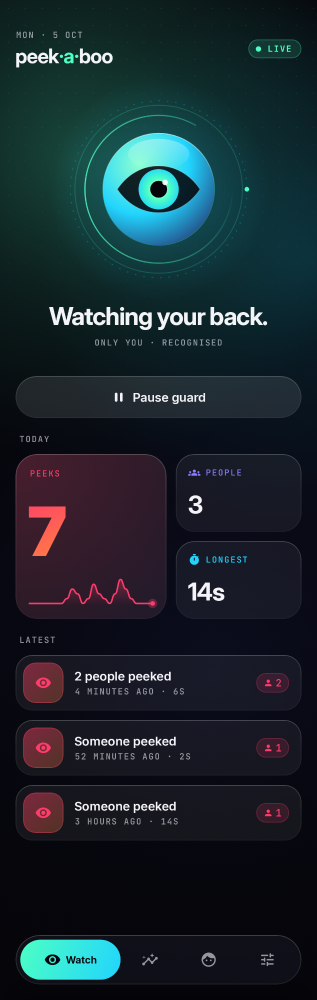
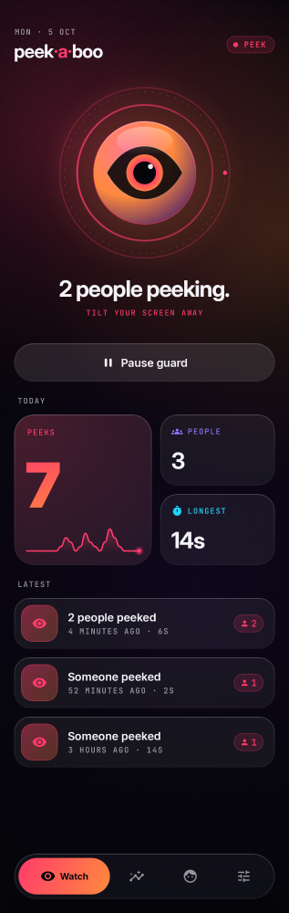
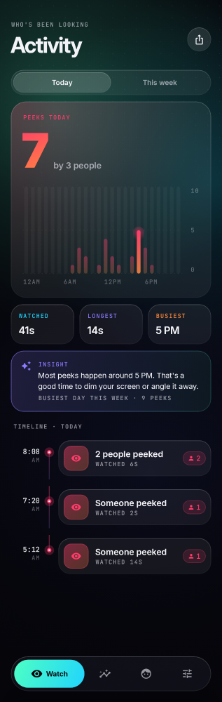
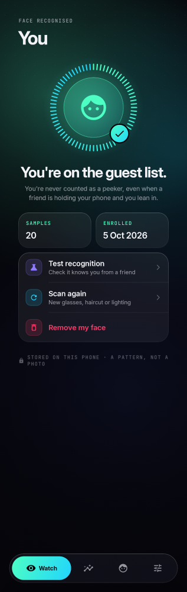
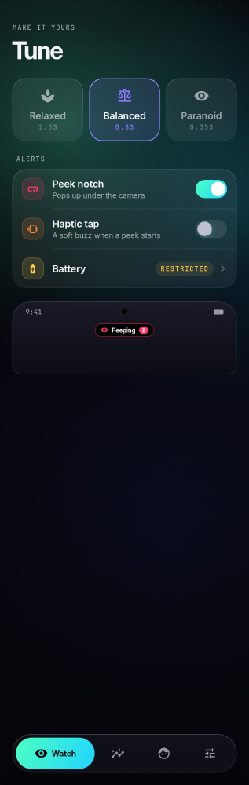

# 👀 Peek-a-Boo

**Catch shoulder surfers.** Peek-a-Boo quietly watches the front camera while you use your phone.
The moment someone else looks at your screen, a Dynamic-Island-style notch pops up right under your
camera — **"Peeping · 2"** — and every peek lands in a beautiful daily report.

### ⬇️ Download

**[PeekABoo.apk](https://github.com/shashank03-dev/peek-a-boo/raw/main/release/PeekABoo.apk)** (Android 8.0+, ~21 MB)

Open the link on your phone → install (allow "install unknown apps" for your browser when asked).

<p>
  
  
  
  
  
</p>

## Design

"Night Watch": a near-black canvas with a slow-drifting aurora that takes on the guard's mood:
mint while watching, violet on standby, hot coral the moment someone peeks. The hero is a glass
"eye" that glances around while guarding, dozes when idle, shuts when off and stares wide open
during a peek. Frosted glass cards in a bento layout, a floating capsule tab bar that echoes the
notch, and monospace labels for times and counts.

## Features

- **Live peek detection** — front camera + ML Kit face detection, ~5 fps when people are around, ~2 fps when the room is empty.
- **"Really peeping" only** — a face must be facing the screen (head yaw/pitch), big enough to read it, and keep looking for a moment (sensitivity: Relaxed / Balanced / Paranoid).
- **Peek notch** — black capsule under the camera with a pulsing eye and a rolling live counter, works over any app.
- **Face ID for you** — enroll your face in ~10 s (iOS-style tick ring). You're never counted as a peeper, even when a friend holds your phone and you lean in. Includes a live recognition test.
- **Daily report** — peeks today, unique people (repeat peekers grouped by face signature), total/longest time watched, busiest hour, hourly + 7-day charts, a timeline with peeker snapshots, shareable summary.
- **Stays alive** — foreground service, only scans while the phone is unlocked, auto-pauses on screen-off, Quick Settings tile, restart after reboot, battery-optimisation shortcut.
- **Private by design** — everything runs on-device. No internet permission, no data leaves the phone.

## Tech

Kotlin · Jetpack Compose (Material 3, custom glass components) · CameraX · Google ML Kit Face Detection ·
Room · DataStore · Haze (frosted-glass tab bar) · Coil · Inter + JetBrains Mono.

## Build

```sh
./gradlew :app:assembleRelease
```

Fonts: Inter by Rasmus Andersson and JetBrains Mono by JetBrains, both SIL Open Font License (see `FONT_LICENSE.txt`).
